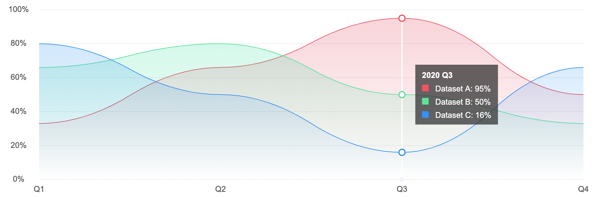

# Graphene

Graphene is a JavaScript powered HTML5 Canvas based graphing library.

## Installation

Install `graphene` via [NPM](https://www.npmjs.com):

`npm install graphene`

## Usage

Import the graphene library:

`import Graphene from 'graphene'`

Create a new instance of the graphene engine:

`var grapheneEngine = new Graphene();`

Then add graphs to it:

`var linegraph = grapheneEngine.addLinegraph(element, properties, data, axisFormatter, informationFormatter);`

Where `element` is the HTML element that the graph is to be positioned in and `properties` and `data` are JSON strings. Refer to the [properties](https://github.com/krystal/graphene/wiki/Properties) and [data](https://github.com/krystal/graphene/wiki/Data) documentation for more information.

### Example properties

```
{
    "flags": {
        "highlight_enabled": true,
        "scroll_enabled": true,
        "zoom_enabled": true
    },
    "y_axis": {
        "label_suffix": [[0, "%"]]
    }
}
```

### Example data

```
{
    "names": ["Dataset A", "Dataset B", "Dataset C"],
    "x":[1577836800000, 1580515200000, 1583020800000, 1585695600000],
    "y":[[33, 66, 95, 50], [66, 80, 50, 33], [80, 50, 16, 66]]
}
```

### Example axisFormatter

```
function axisFormatter(value, interval) {
    const months = ["Jan", "Feb", "Mar", "Apr", "May", "Jun", "Jul", "Aug", "Sep", "Oct", "Nov", "Dec"];
    var date = new Date(value);
    return months[date.getUTCMonth()];
}
```

### Example informationFormatter

```
function informationFormatter(value, interval) {
    const months = ["Jan", "Feb", "Mar", "Apr", "May", "Jun", "Jul", "Aug", "Sep", "Oct", "Nov", "Dec"];
    var date = new Date(value);
    var month = months[date.getUTCMonth()];
    var year = date.getUTCFullYear();
    return month + " " + year;
}
```

## Styles

Colours, fonts, sizes, etc. can all be defined via CSS variables, graphene will look for styles that have been applied to the supplied HTML element. Refer to the [styles](https://github.com/krystal/graphene/wiki/Styles) documentation for more information.

### Example styles

```
.graph_light_mode {
  --colours-background: #FFFFFF;
  ...
  --fonts-axes-labels-family: "Arial";
  ...
  --widths-data: 1;
}
```

## HTML

Simply add a HTML element to your page, graphene will inherit the dimensions of this element.

### Example HTML

```
<div class="graph_light_mode" height="320" style="position:relative;"></div>
```

When everything is in place, it is time to draw:

`grapheneEngine.render();`

Putting together all this example code produces the following graph:


