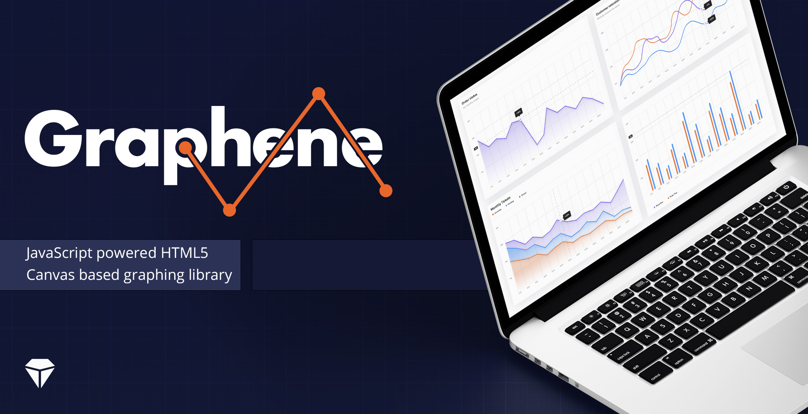

The Graphene library currently includes line and bar graphs.

To get stuck straight in, follow the [tutorial](https://github.com/krystal/graphene/wiki/Tutorial) and, for more detailed information about the library, visit the [Wiki](https://github.com/krystal/graphene/wiki).
